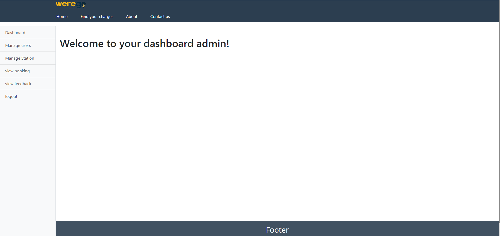
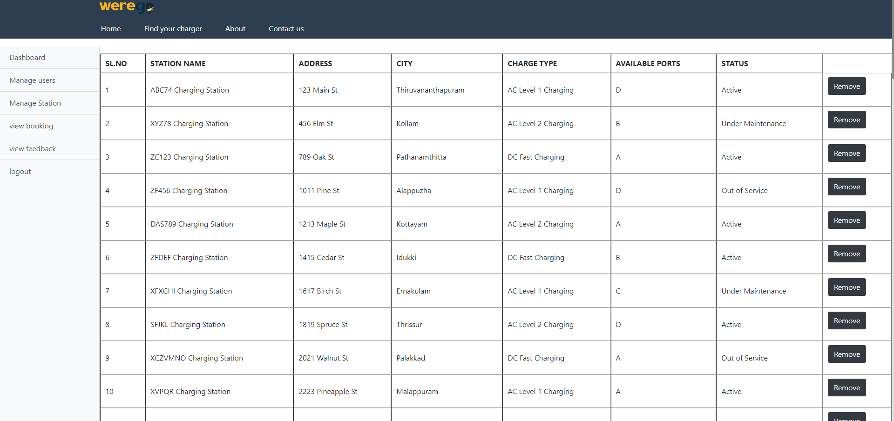
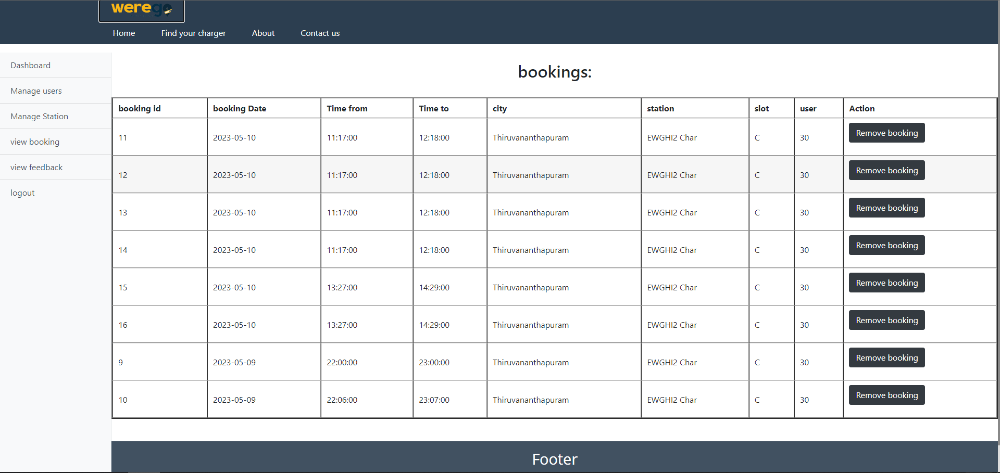
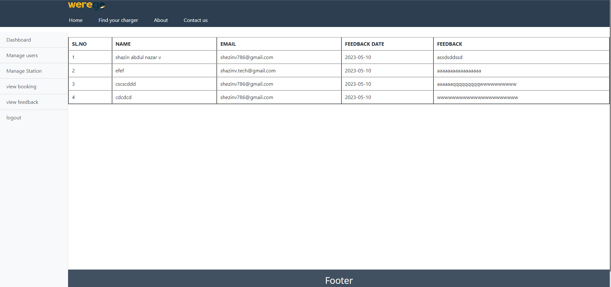
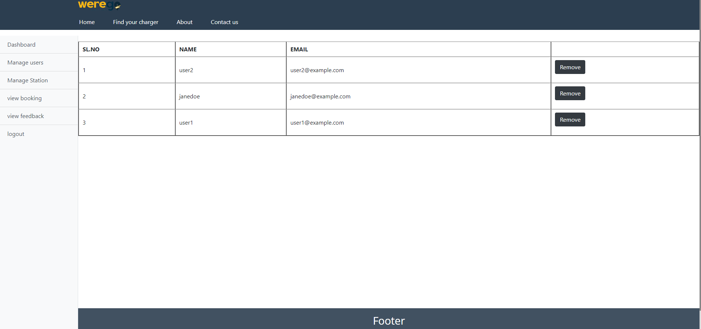
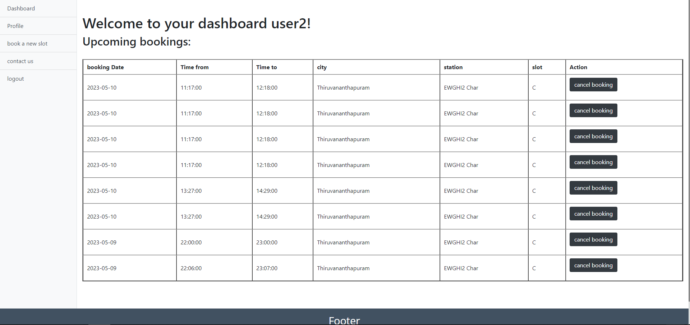
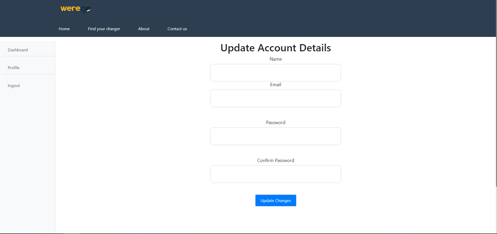
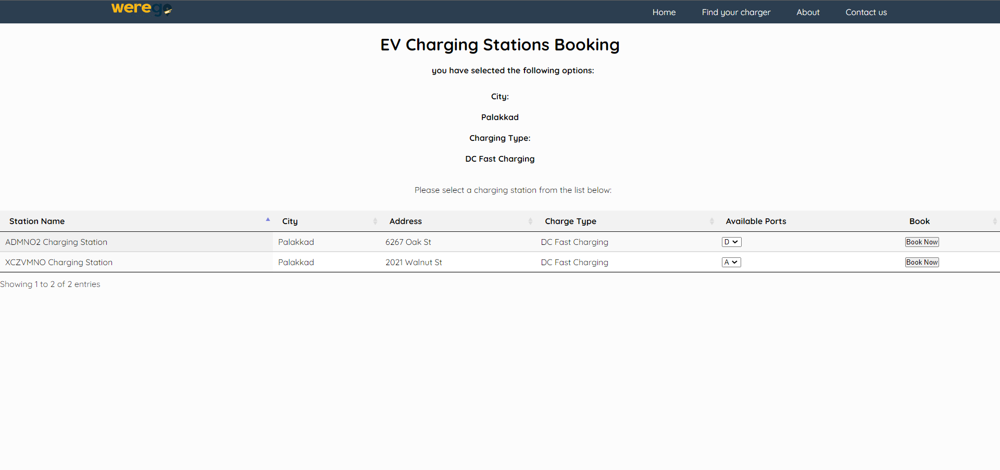
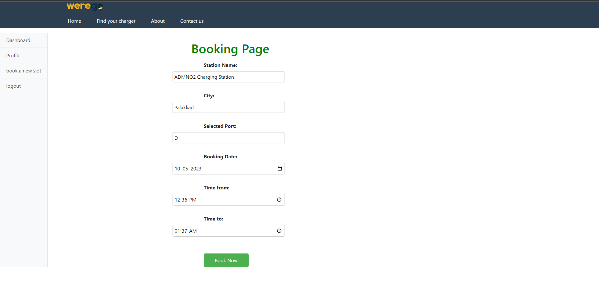

# Werego - Electric Vehicle Charging Station Finder


## Overview

The advent of electric vehicles (EVs) has ushered in a new era of eco-friendly and sustainable transportation. However, a significant challenge faced by EV owners is the availability of charging infrastructure. To address this issue, Werego is an innovative web-based system that empowers EV owners to locate, access, and reserve charging stations conveniently.

### Key Features

- **Charging Station Search:** Quickly find nearby charging stations by selecting your location from a list. Get detailed information about available stations, including address, city, charge type, and available slots.

- **Charging Station Details:** View comprehensive information about each charging station, making it easy to choose the most suitable one for your needs.

- **Slot Booking:** Reserve available charging slots at your preferred station. Manage your bookings, and even cancel them if your plans change.

- **User Management:** Create an account, log in, and access your booking history. User-friendly features like password reset and email verification enhance your experience.

- **Admin Panel:** Charging station operators can manage their stations and slots effortlessly through the admin panel. This feature allows operators to add or remove charging stations, update station details, and review booking history.

## Prerequisites

Ensure you have the following software and tools installed:

- **Technology:** Python
- **Integrated Development Environment (IDE):** VSCode (or any preferred Python IDE)
- **Framework:** Flask
- **Database:** MySQL

## Installation

Follow these steps to set up the Werego project:

1. Clone the repository to your local machine:

   ```bash
   git clone https://github.com/shezi7025/werego.git


## Usage

Start the Application: Launch the Werego application.

Search for Charging Stations: Use the search feature to find charging stations near you.

View Station Details: Click on a station to view its details.

Book a Charging Slot: Reserve an available slot at your chosen station.

Admin Features: If you are a charging station operator, log in to the admin panel to manage your stations and slots.


## screenshots
Home Page


## Admin - Page


Admin Dashboard


Managing station


View booking


Manage feedback


Manage users

## User - page


User Dashboard


User Profile Update


Searching Nearby Station


Booking Page


## Contributing
We welcome contributions from the community to improve Werego. To contribute:

Fork the repository.
Create a new branch for your feature or bug fix.
Commit your changes and push them to your fork.
Submit a pull request to the main repository.
 
